# Connect Chat

## Logical View

### Milestone 01: System Scaffolding & Real-time Protocol

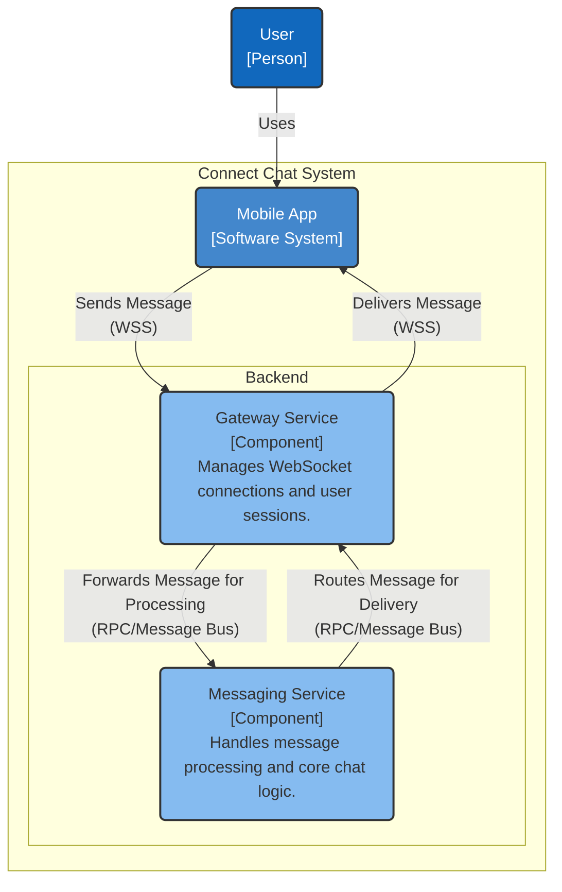

### Milestone 02: Session Registry & Service Discovery

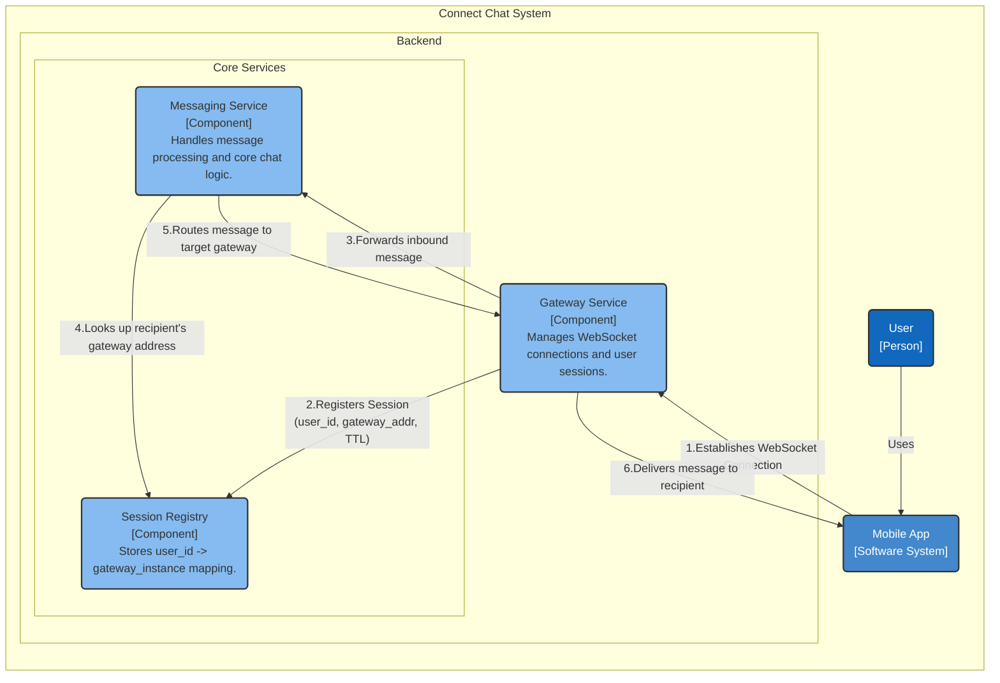

### Milestone 03: Inter-Service Communication & 1-to-1 Routing

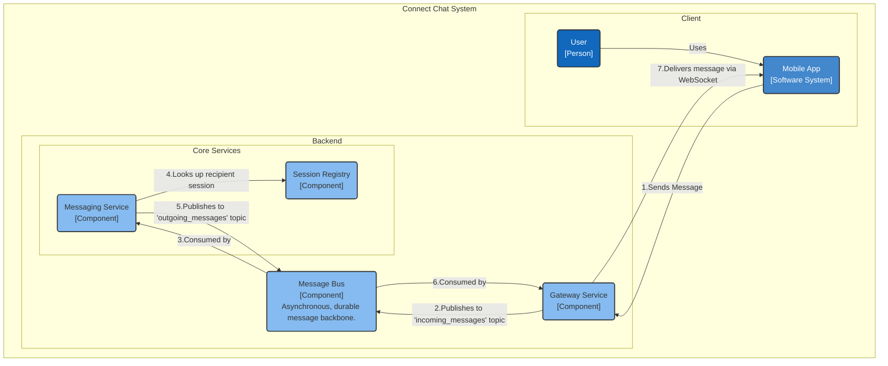

### Milestone 04: Chat History Persistence

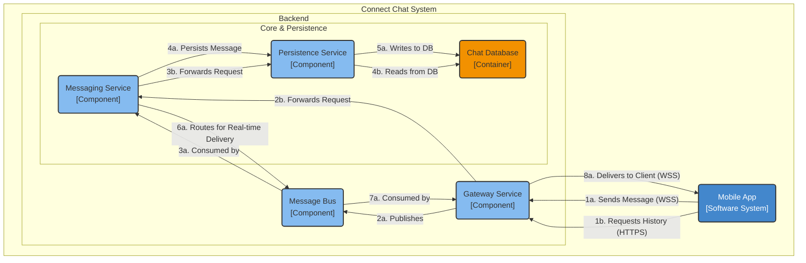

### Milestone 05: Offline Message Delivery System

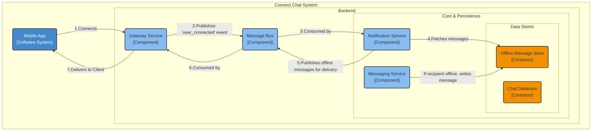

### Milestone 06: Horizontal Scalability & High Availability

### Milestone 07: Group Management Service

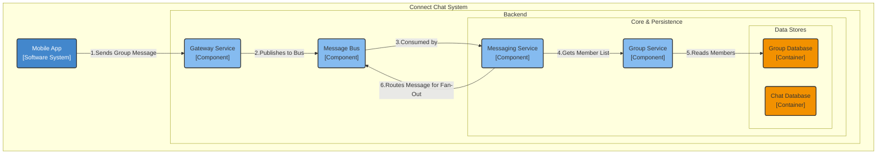

### Milestone 08: Group Message Fan-Out

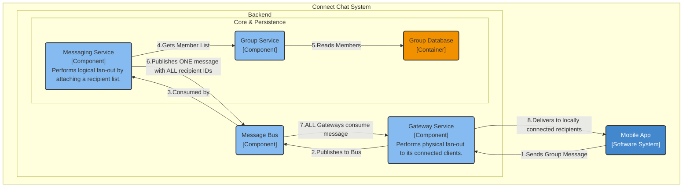

### Milestone 09: Global Message Ordering

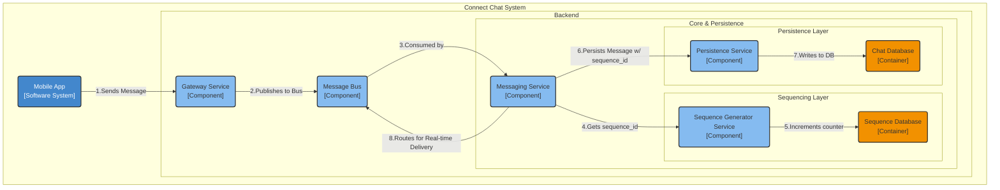

### Overall Logical View

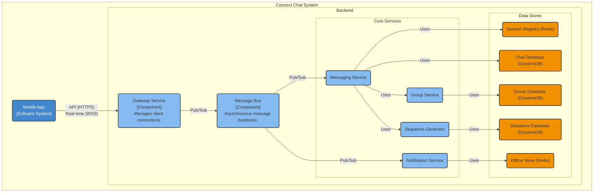

## Physical View

### Milestone 01: System Scaffolding & Real-time Protocol

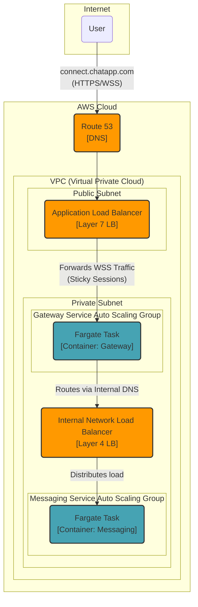

### Milestone 02: Session Registry & Service Discovery

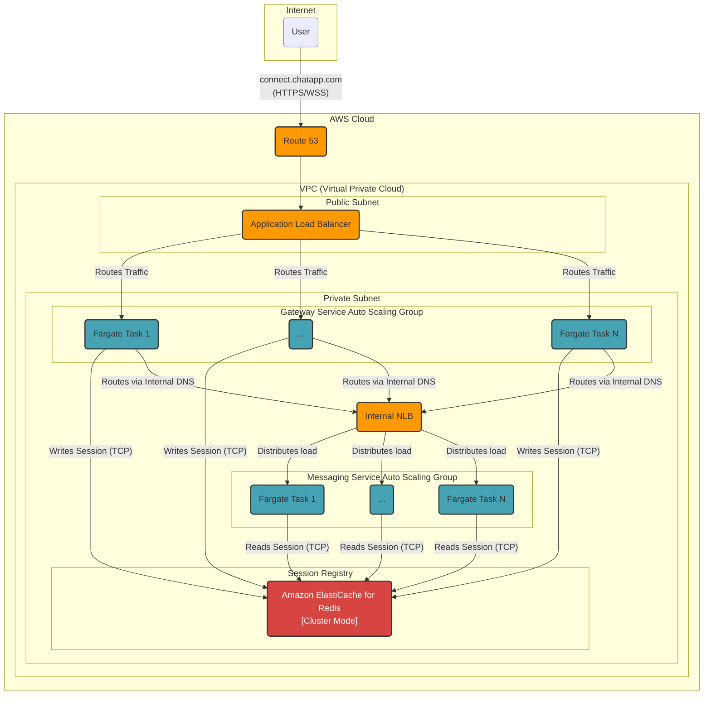

### Milestone 03: Inter-Service Communication & 1-to-1 Routing

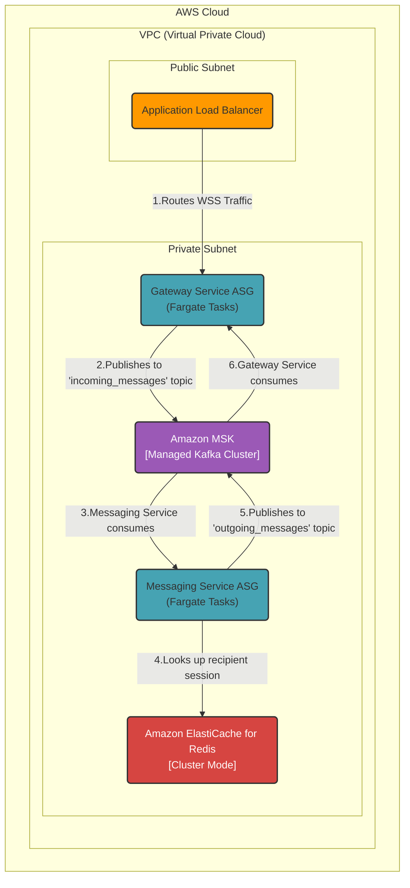

### Milestone 04: Chat History Persistence

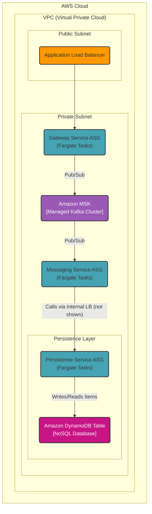

### Milestone 05: Offline Message Delivery System

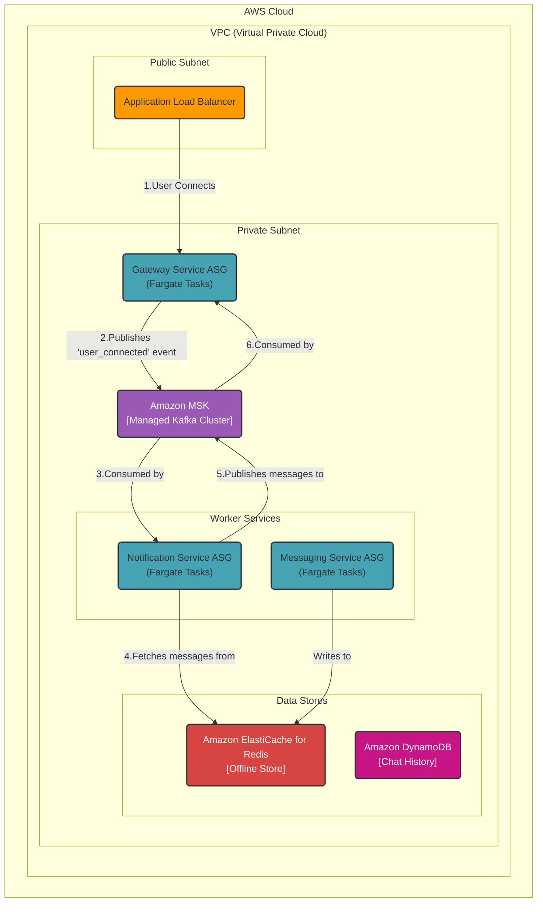

### Milestone 06: Horizontal Scalability & High Availability

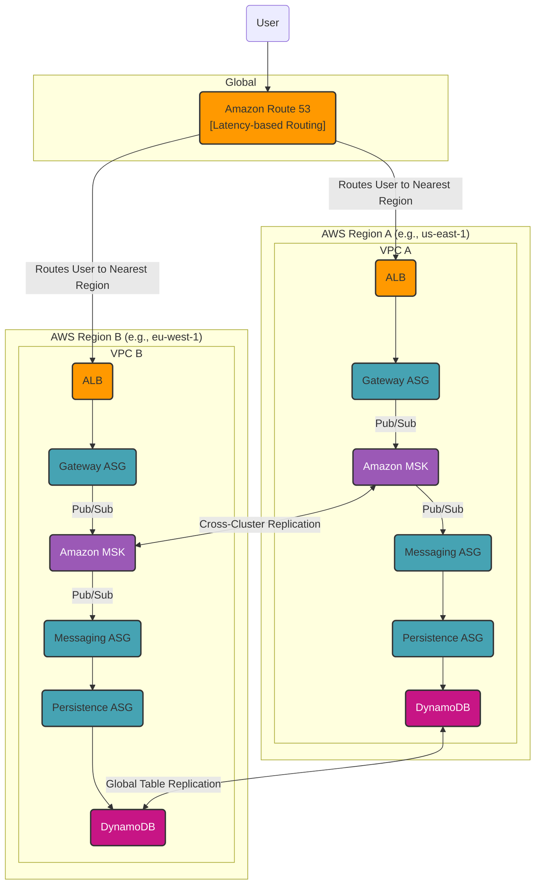

### Milestone 07: Group Management Service

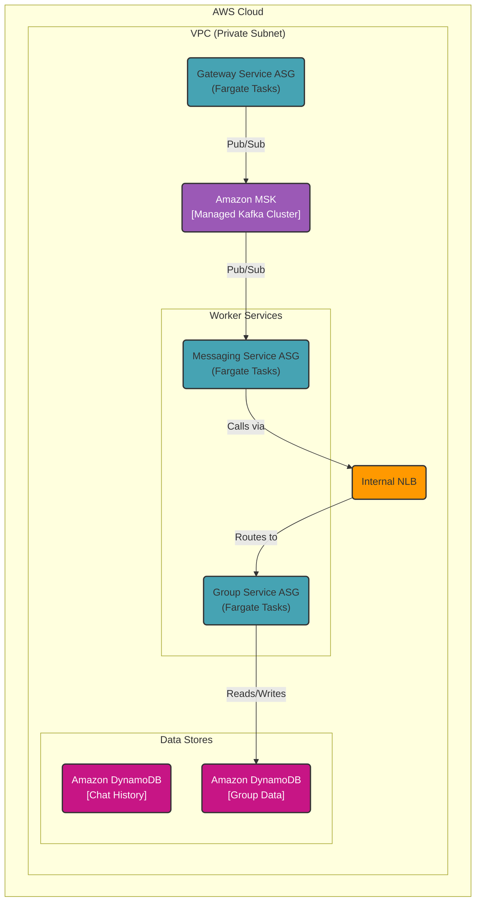

### Milestone 08: Group Message Fan-Out

### Milestone 09: Global Message Ordering

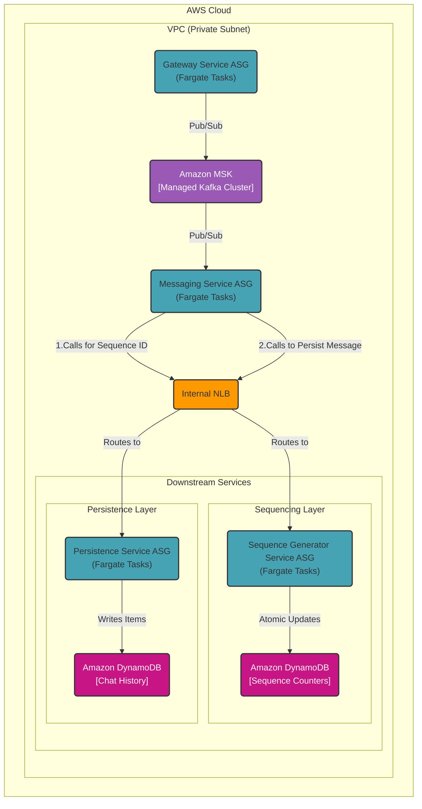

### Overall Physical View

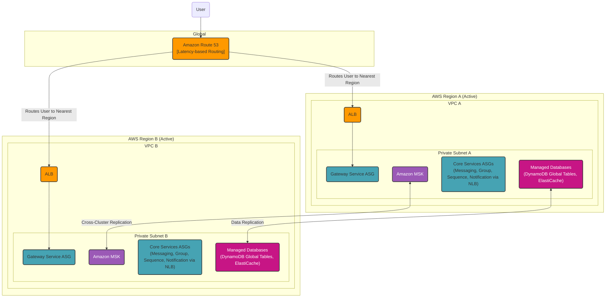
