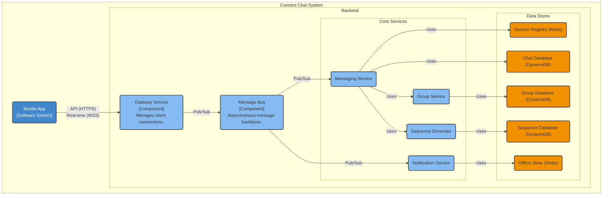
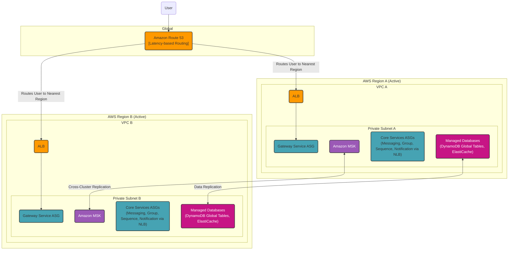

#### **Overall Logical View (C4 Component Diagram)**

This diagram represents the complete logical architecture of the Connect Chat service, showing all components and their primary responsibilities.

#### **Overall Physical View (AWS Deployment Diagram)**

This diagram represents the complete, multi-region, highly available physical deployment architecture for the Connect Chat service.

