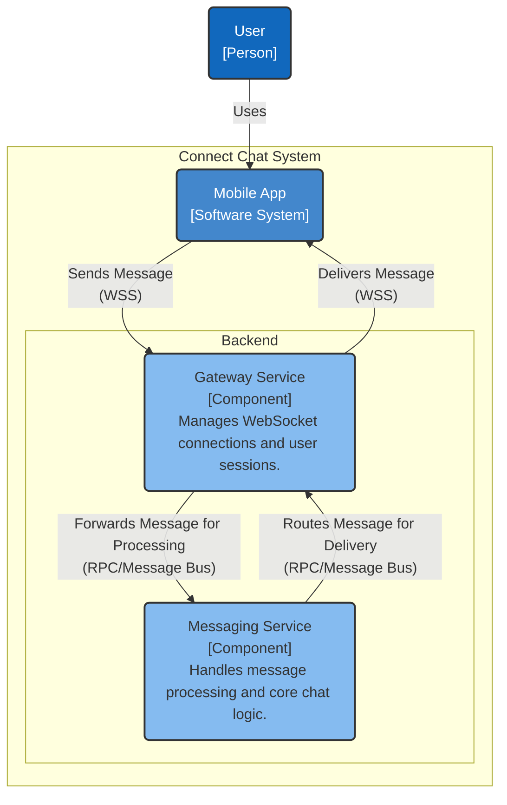
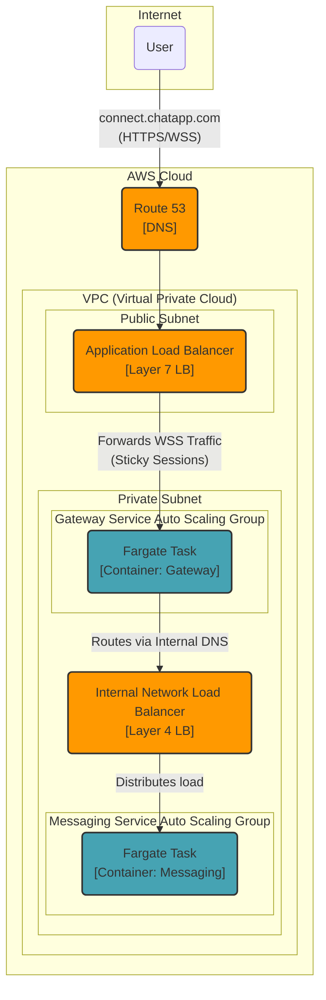

### **System Scaffolding & Real-time Protocol**

**Problem:**
To fulfill the core functional requirement of real-time messaging (FR3.1) and the low-latency non-functional requirement (NFR2.1), the system needs a way for clients to maintain a persistent, bidirectional communication channel with the backend. A traditional HTTP request-response model is inefficient for this, as it would require constant polling, introducing significant latency and network overhead.

**Solution:**
We will establish the initial system scaffold with two core microservices:
1.  A stateful **Gateway Service** to manage persistent client connections.
2.  A stateless **Messaging Service** to handle core business logic.

For the real-time communication layer, we will use the **WebSocket** protocol. Clients will establish a persistent WebSocket connection with the Gateway Service, which will then be used for all subsequent real-time message and event exchanges.

**Trade-offs:**
*   **Protocol Choice (WebSockets):**
    *   **Pros:**
        *   **Full-duplex:** Allows for true, low-latency bidirectional communication, which is ideal for chat.
        *   **Efficiency:** After the initial handshake, data frames require very little overhead compared to HTTP headers.
        *   **Stateful Connection:** Reduces the overhead of repeatedly establishing TCP connections, unlike polling.
    *   **Cons:**
        *   **Resource Intensive:** Persistent connections consume memory and CPU on server instances. The architecture must be designed to scale horizontally to handle this.
        *   **Firewall/Proxy Issues:** Some older corporate firewalls may not support WebSocket traffic, although this is becoming less common.
*   **Alternative Considered (Long Polling):**
    *   Avoided due to higher latency and significant overhead. Every message would still require a full HTTP request/response cycle, making it inefficient at our target scale.

---

#### **Logical View (C4 Component Diagram)**

#### **Physical View (AWS Deployment Diagram)**

#### **Component-to-Resource Mapping Table**

| Logical Component   | Physical Resource       | Rationale                                                                                                                                                                                                                         |
| ------------------- | ----------------------- | --------------------------------------------------------------------------------------------------------------------------------------------------------------------------------------------------------------------------------- |
| **Gateway Service** | **AWS Fargate Tasks in an Auto Scaling Group**    | **Serverless & Scalable:** Fargate manages the underlying infrastructure. Placing tasks in an Auto Scaling Group within a **private subnet** ensures they are secure and can scale horizontally to handle millions of concurrent WebSocket connections. |
| **Messaging Service** | **AWS Fargate Tasks in an Auto Scaling Group**    | **Stateless & Secure:** Running as auto-scaling Fargate tasks in a **private subnet** ensures the core logic is secure and can be scaled independently of the connection layer, optimizing resource use. |
| **(New) Network Boundary** | **AWS VPC with Public/Private Subnets** | **Security Best Practice:** This isolates our application from the public internet. The ALB acts as a secure, managed entry point in the public subnet, while our core services are protected within the private subnets. |
| **(New) Internal Communication** | **Internal Network Load Balancer (NLB)** | **High-Performance & Reliable:** An internal NLB is optimized for high-throughput, low-latency TCP traffic within a VPC. It provides a stable internal endpoint for the Messaging Service, decoupling it from the Gateway Service and enabling independent scaling and deployments. |
