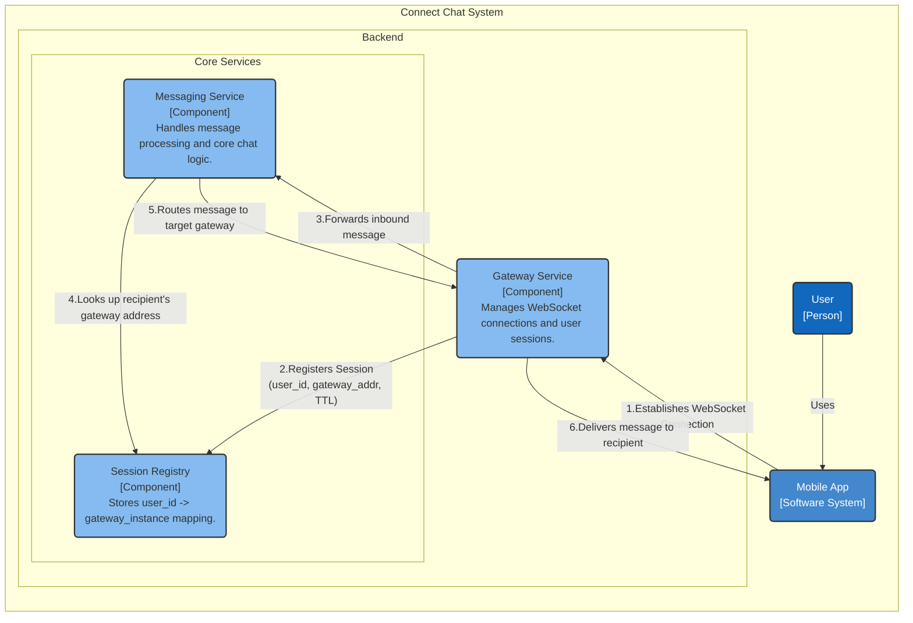
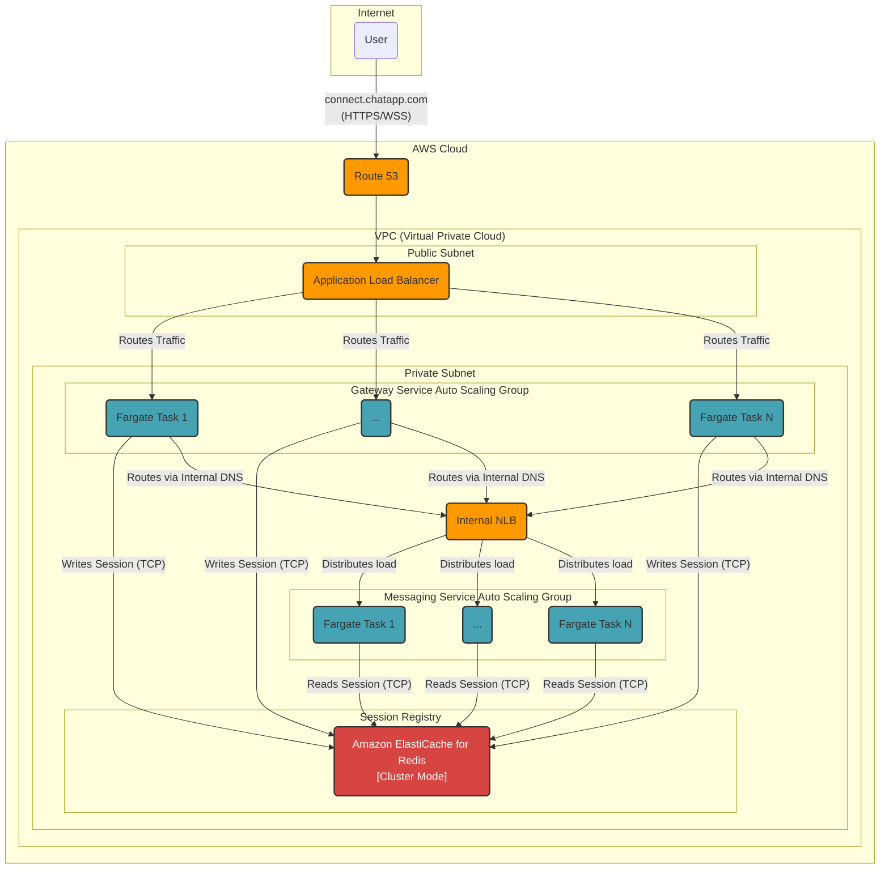

### **Session Registry & Service Discovery**

**Problem:**
Our Gateway Service is designed to be horizontally scalable, meaning we will have many instances running. When a user sends a message, the system must be able to determine exactly which Gateway instance the recipient is connected to in order to deliver the message. Without a central mapping, each Gateway instance is an isolated island, making message routing impossible in our distributed setup. We need a highly performant and scalable way to look up this `user_id -> gateway_instance` mapping.

**Solution:**
We will introduce a new logical component: the **Session Registry**. This component will be implemented as a high-speed, in-memory key-value store.
The workflow will be as follows:
1.  When a client successfully establishes a WebSocket connection, the receiving **Gateway Service** instance will write an entry to the Session Registry, mapping the authenticated `user_id` to its own unique instance identifier (e.g., `user_123 -> gateway_instance_A`).
2.  A Time-To-Live (TTL) will be set on this entry to automatically handle stale or disconnected sessions.
3.  When routing a message, the **Messaging Service** will query the Session Registry with the recipient's `user_id` to retrieve the address of their currently connected Gateway instance.

**Trade-offs:**
*   **Technology Choice (In-Memory Cache like Redis):**
    *   **Pros:**
        *   **Extreme Low Latency:** In-memory lookups are orders of magnitude faster than disk-based database queries, which is essential for meeting our <500ms P99 latency requirement for every message.
        *   **Scalability:** Modern in-memory caches like Redis can be clustered to scale horizontally and handle millions of reads/writes per second.
        *   **Built-in TTL:** The ability to set an expiry on keys is a perfect fit for managing session lifecycle without complex cleanup logic.
    *   **Cons:**
        *   **Infrastructure Overhead:** It introduces a new, stateful component to our architecture that must be managed, monitored, and scaled.
        *   **Data Durability:** By default, it's not a durable store. A Redis crash could lead to a loss of session data, forcing clients to reconnect, but this is an acceptable trade-off for a non-critical cache.
*   **Alternative Considered (Using a persistent database):**
    *   This was rejected because querying a disk-based database for every single message would add significant latency and create an unmanageable load on the database, making it a performance bottleneck.

---

#### **Logical View (C4 Component Diagram)**

#### **Physical View (AWS Deployment Diagram)**

#### **Component-to-Resource Mapping Table**

| Logical Component | Physical Resource | Rationale |
| :--- | :--- | :--- |
| **Gateway Service** | **AWS Fargate Tasks in an Auto Scaling Group** | **Serverless & Scalable:** Fargate manages the underlying infrastructure. Placing tasks in an Auto Scaling Group within a **private subnet** ensures they are secure and can scale horizontally to handle millions of concurrent WebSocket connections. |
| **Messaging Service**| **AWS Fargate Tasks in an Auto Scaling Group** | **Stateless & Secure:** Running as auto-scaling Fargate tasks in a **private subnet** ensures the core logic is secure and can be scaled independently of the connection layer, optimizing resource use. |
| **Session Registry**| **Amazon ElastiCache for Redis (Cluster Mode)** | **Low Latency & Scalability:** ElastiCache provides a managed, in-memory Redis cluster. This is ideal for the high-speed key-value lookups required for session management. Cluster mode ensures high availability and scalability to handle our 50M concurrent user load. Its location in a private subnet secures session data. |
| **(Updated) Network**| **AWS VPC, ALB, Internal NLB** | **Security & Performance:** The VPC provides isolation. The ALB handles public TLS termination and sticky sessions. The internal NLB provides a high-performance, stable endpoint for inter-service communication within the secure private subnet. |
