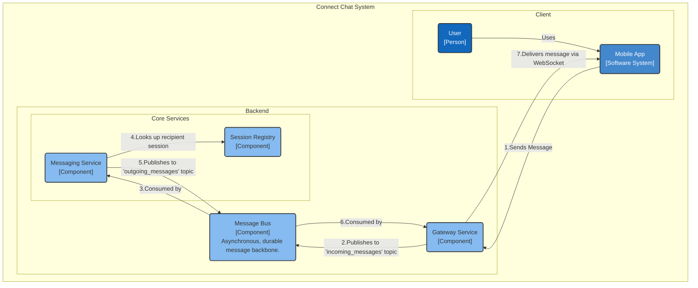
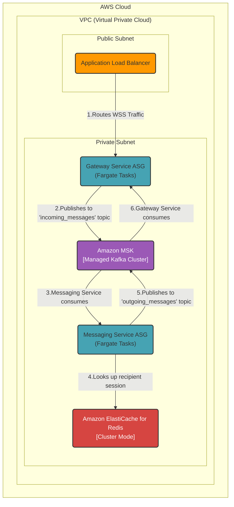

### **Inter-Service Communication & 1-to-1 Routing**

**Problem:**
The current architecture implies a direct, synchronous communication path between the Gateway and Messaging services. This creates tight coupling, where a slowdown or failure in the Messaging Service could block the Gateway Service, jeopardizing its ability to manage thousands of client connections. This synchronous model is not resilient enough to meet our high availability (NFR3.1) and guaranteed delivery (NFR4.1) requirements at scale.

**Solution:**
We will introduce a **Message Bus** to act as the central, asynchronous communication backbone between services, implementing a publish-subscribe (Pub/Sub) pattern.
1.  **Gateway Service (Producer):** Upon receiving a message from a client, the Gateway will publish it to a message bus topic (e.g., `incoming_messages`).
2.  **Messaging Service (Consumer/Producer):** This service will subscribe to the `incoming_messages` topic. After processing a message (e.g., validation, querying the Session Registry), it will publish the message to a topic designated for delivery (e.g., `outgoing_messages`).
3.  **Gateway Service (Consumer):** Each Gateway instance will also subscribe to the `outgoing_messages` topic. It will consume messages and deliver them only to the clients currently connected to it.

This asynchronous model decouples the services, provides a durable buffer for messages, and enhances overall system resilience and scalability.

**Trade-offs:**
*   **Technology Choice (Message Bus - Amazon MSK/Kafka):**
    *   **Pros:**
        *   **Decoupling:** Services can be developed, deployed, and scaled independently.
        *   **Resilience & Durability:** The bus acts as a buffer. If a consumer service fails, messages are retained in the bus and can be processed upon recovery, ensuring no data loss.
        *   **Load Balancing:** The bus naturally distributes the message load among available consumer instances.
    *   **Cons:**
        *   **Increased Latency:** Introduces an additional network hop, which slightly increases end-to-end latency. However, the gains in reliability and scalability are a necessary trade-off.
        *   **Operational Complexity:** Adds a new, critical piece of infrastructure that requires management and monitoring. Using a managed service like Amazon MSK mitigates much of this burden.
*   **Alternative Considered (Direct RPC):**
    *   Rejected due to the tight coupling and lack of fault tolerance. A failure in the `Messaging Service` would cascade directly to the `Gateway Service`, potentially causing widespread disconnections.

---

#### **Logical View (C4 Component Diagram)**

#### **Physical View (AWS Deployment Diagram)**

#### **Component-to-Resource Mapping Table**

| Logical Component | Physical Resource | Rationale |
| :--- | :--- | :--- |
| **Gateway Service** | **AWS Fargate Tasks (Auto Scaling)** | (Unchanged) Serverless compute for managing stateful WebSocket connections. Acts as a Producer and Consumer to the message bus. |
| **Messaging Service**| **AWS Fargate Tasks (Auto Scaling)** | (Unchanged) Stateless, serverless compute for core logic. Acts as a Consumer and Producer to the message bus. |
| **Session Registry**| **Amazon ElastiCache for Redis (Cluster Mode)** | (Unchanged) Provides a high-performance, low-latency, and scalable in-memory store for session mapping. |
| **(New) Message Bus**| **Amazon MSK (Managed Streaming for Apache Kafka)** | **Durability & Scalability:** MSK provides a fully managed, highly available Kafka cluster. Kafka is the industry standard for high-throughput, persistent message streaming, making it ideal for decoupling our services and buffering messages to guarantee delivery, even during service downtime. |
