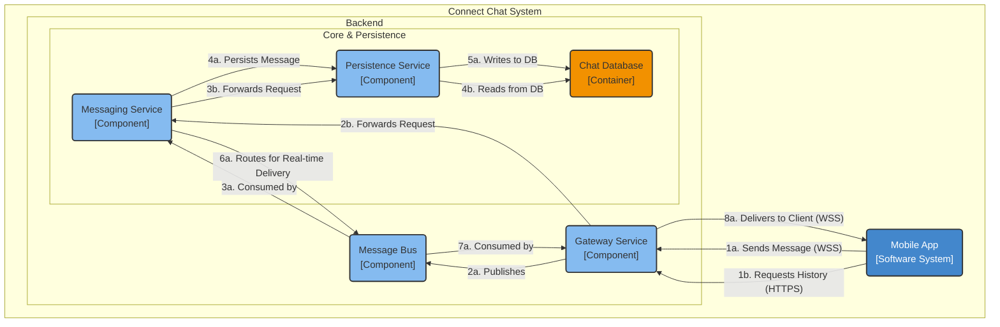
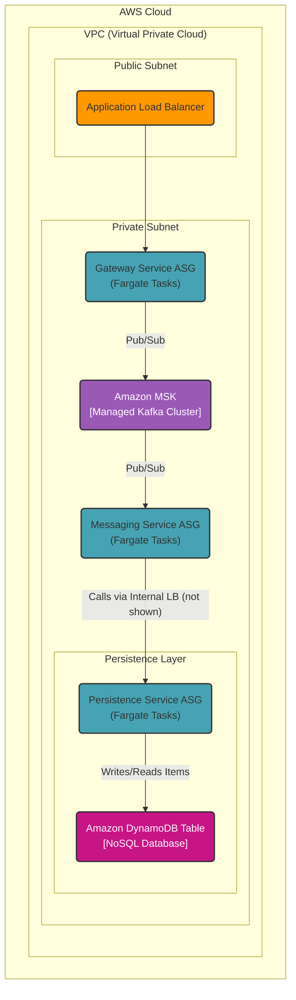

### **Chat History Persistence**

**Problem:**
The current architecture successfully routes real-time messages but does not store them, failing to meet the requirement for persistent chat history (FR1.2). Users expect to view past conversations and have their message history synchronized across devices. We need a highly durable and scalable storage solution optimized for a massive write load and time-series-based queries.

**Solution:**
We will introduce a new logical component, the **Persistence Service**, responsible for all database interactions. The message flow will be updated:
1.  After the **Messaging Service** consumes a message from the bus, it will asynchronously call the **Persistence Service** to write the message to a new **Chat Database**.
2.  This database will be designed with a schema optimized for the primary access pattern: retrieving a slice of messages for a given conversation, sorted chronologically.

This approach decouples the core message routing logic from the storage implementation, allowing each to be scaled and maintained independently.

**Trade-offs:**
*   **Technology Choice (Amazon DynamoDB):**
    *   **Pros:**
        *   **Massive Scalability:** DynamoDB is a managed NoSQL database that offers seamless horizontal scaling, making it ideal for the high-throughput write operations required by a chat service (NFR1.3).
        *   **Low Latency:** Provides single-digit millisecond latency for reads and writes at any scale.
        *   **Data Model Fit:** Its key-value/wide-column model is a natural fit for chat messages. We can use a composite primary key (`Partition Key: chat_id`, `Sort Key: timestamp`) to efficiently query for message history.
        *   **Managed Service:** AWS handles all the operational overhead of partitioning, replication, and scaling.
    *   **Cons:**
        *   **Query Flexibility:** Complex analytical queries are more difficult than with a traditional SQL database. This is an acceptable trade-off as our primary need is for a specific, high-performance query pattern.
*   **Alternative Considered (Relational Database like RDS PostgreSQL):**
    *   Rejected due to the challenges of scaling write-heavy workloads. While PostgreSQL is an excellent database, managing sharding and partitioning for a system with 10 million writes per second would introduce significant operational complexity and cost.

---

#### **Logical View (C4 Component Diagram)**

#### **Physical View (AWS Deployment Diagram)**

#### **Component-to-Resource Mapping Table**

| Logical Component | Physical Resource | Rationale |
| :--- | :--- | :--- |
| **Gateway Service** | **AWS Fargate Tasks (Auto Scaling)** | (Unchanged) Serverless compute for managing WebSocket connections. |
| **Messaging Service**| **AWS Fargate Tasks (Auto Scaling)** | (Unchanged) Stateless, serverless compute for core routing logic. |
| **Message Bus** | **Amazon MSK (Managed Kafka)** | (Unchanged) Durable, scalable backbone for asynchronous inter-service communication. |
| **(New) Persistence Service** | **AWS Fargate Tasks (Auto Scaling)** | **Decoupled & Secure:** A dedicated service for database operations, running in a private subnet. This isolates database credentials and logic, and allows the persistence layer to be scaled independently based on DB load. |
| **(New) Chat Database** | **Amazon DynamoDB Table** | **Scalability & Performance:** A managed NoSQL database that provides the low-latency, high-throughput performance required for our massive write load. Its key-value structure is a perfect fit for storing and querying chat messages. |
