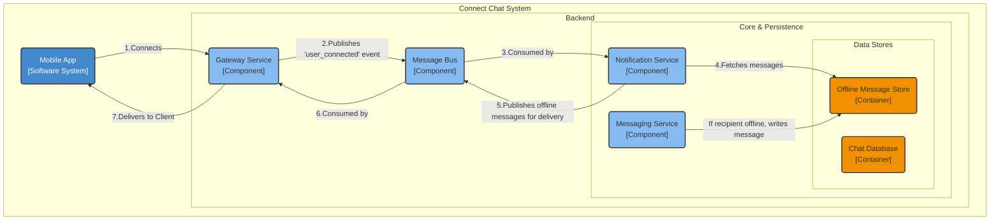
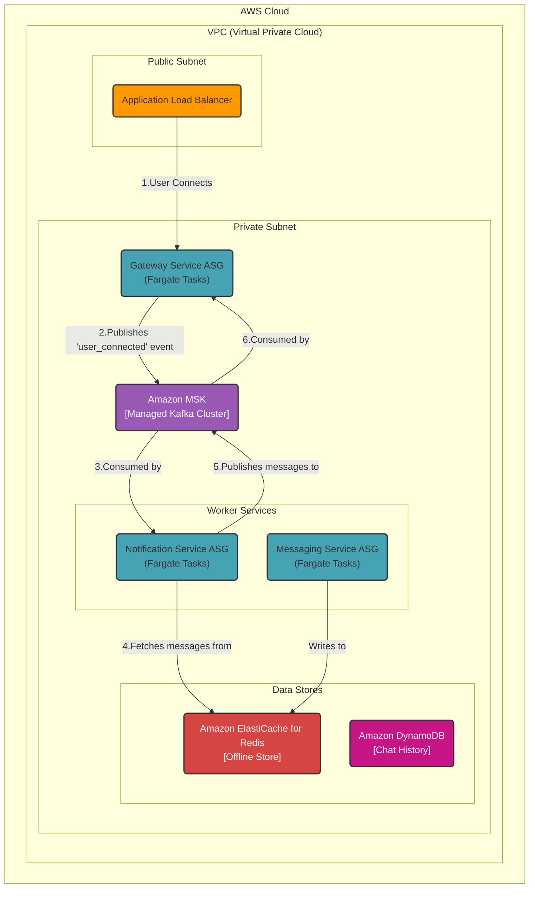

### **Offline Message Delivery System**

**Problem:**
The current architecture successfully persists all messages to a historical database. However, it does not fulfill the requirement for offline message delivery (FR3.2). When a user sends a message to an offline recipient, the message is stored but never actively pushed to the recipient when they reconnect. Users expect to receive all missed messages immediately upon logging in.

**Solution:**
We will introduce two new components: a dedicated **Offline Message Store** and a **Notification Service**.

The updated workflow is:
1.  When the **Messaging Service** processes a message, it checks the **Session Registry**.
2.  If the recipient is **offline**, the Messaging Service writes the message to a new, dedicated **Offline Message Store**. This store acts as a temporary inbox for each user.
3.  When a user establishes a new connection, the **Gateway Service** sends a `user_connected` event to the **Message Bus**.
4.  The new **Notification Service** consumes these `user_connected` events.
5.  Upon receiving an event, the Notification Service queries the **Offline Message Store** for any pending messages for that user.
6.  It retrieves the messages and publishes them to the `outgoing_messages` topic on the **Message Bus** for immediate delivery by the user's Gateway instance.
7.  After the client acknowledges receipt, the messages are deleted from the Offline Message Store.

**Trade-offs:**
*   **Technology Choice (Dedicated Offline Store - Redis):**
    *   **Pros:**
        *   **Performance:** A cache like Redis is optimized for the high-speed read and delete operations required when a user logs in and clears their offline queue.
        *   **Decoupling:** It separates the responsibility of temporary, queue-like storage from the long-term, write-optimized `Chat Database`, preventing performance conflicts.
        *   **TTL Support:** Redis TTL can automatically purge very old (e.g., >30 days) undelivered messages, fulfilling FR3.2.
    *   **Cons:**
        *   **Increased Infrastructure:** Adds another stateful component to the system that requires management. Using a managed service like ElastiCache minimizes this.
        *   **Data Duplication:** A message to an offline user is temporarily stored in both the main Chat DB (for history) and the Redis offline store. This is a deliberate trade-off for performance.
*   **Alternative Considered (Using the main Chat DB with a status flag):**
    *   Rejected due to poor scalability. This would require every user login to trigger a complex "find unread" query against the massive, write-optimized DynamoDB table, creating a significant performance bottleneck.

---

#### **Logical View (C4 Component Diagram)**

#### **Physical View (AWS Deployment Diagram)**

#### **Component-to-Resource Mapping Table**

| Logical Component | Physical Resource | Rationale |
| :--- | :--- | :--- |
| **Gateway Service** | **AWS Fargate Tasks (Auto Scaling)** | (Unchanged) Manages client connections. Now also publishes a `user_connected` event on successful connection. |
| **Messaging Service**| **AWS Fargate Tasks (Auto Scaling)** | (Unchanged) Core logic. Now has the added responsibility of checking user online status and writing to the Offline Store if necessary. |
| **Message Bus** | **Amazon MSK (Managed Kafka)** | (Unchanged) Asynchronous backbone for all inter-service communication. |
| **Chat Database** | **Amazon DynamoDB Table** | (Unchanged) The primary durable store for all message history. |
| **(New) Notification Service** | **AWS Fargate Tasks (Auto Scaling)** | **Decoupled & Event-Driven:** A dedicated service that reacts to `user_connected` events. This keeps the complex offline delivery logic separate from the main messaging and gateway services, improving maintainability. |
| **(New) Offline Message Store** | **Amazon ElastiCache for Redis (Cluster Mode)** | **High Performance & Fit-for-Purpose:** Provides a managed, low-latency, in-memory store perfectly suited for the temporary queue-like behavior (write, read once, delete) of an offline inbox. |
