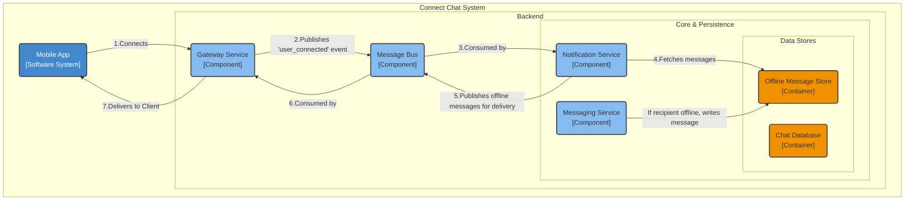
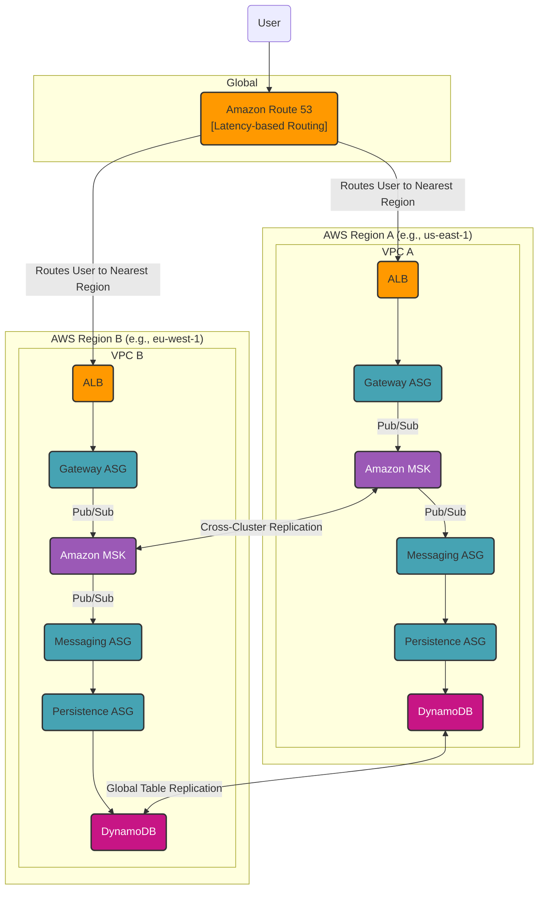

### **Horizontal Scalability & High Availability**

**Problem:**
The current architecture is designed to scale *within* a single AWS region but does not meet the requirements for high availability (NFR3.1 - 99.99% uptime) and resilience against regional data center failures (NFR3.2). A single-region deployment represents a single point of failure; an outage in that region would take down our entire service.

**Solution:**
We will deploy the entire architecture in a **multi-region, active-active configuration**.
1.  **Global Traffic Management:** We will use **Amazon Route 53** with latency-based routing. This will direct users to the AWS region that provides the lowest latency for them, improving global performance and enabling automatic failover.
2.  **Regional Deployments:** Each supported region (e.g., `us-east-1`, `eu-west-1`) will contain a complete, independent stack of our services (ALB, Fargate services, MSK, ElastiCache).
3.  **Global Data Replication:** Critical stateful data will be replicated across regions.
    *   The **Chat Database (DynamoDB)** will be configured as a **Global Table**, providing fast, local read/write performance and automatic multi-master replication.
    *   The **Message Bus (MSK)** will use cross-cluster replication tools (like MirrorMaker 2) to ensure messages can be routed globally.
    *   The **Session Registry (Redis)** will remain region-local, as session data is ephemeral and cross-region lookups would introduce too much latency. Cross-region routing will be handled by the message bus.

**Trade-offs:**
*   **Multi-Region Active-Active Strategy:**
    *   **Pros:**
        *   **Highest Availability:** Can withstand a full regional outage with no downtime, as traffic is automatically routed to the healthy region(s).
        *   **Low Global Latency:** Users are served from their nearest region, providing a faster user experience.
    *   **Cons:**
        *   **Higher Cost & Complexity:** Running and maintaining duplicate infrastructure across multiple regions significantly increases cost and operational overhead.
        *   **Eventual Consistency:** Cross-region data replication introduces latency. The system must be designed to handle eventual consistency (e.g., a message written in the US might take a few hundred milliseconds to be visible in the EU). This is an acceptable trade-off for a chat application.
*   **Alternative Considered (Active-Passive Failover):**
    *   This was rejected because the failover process is not instantaneous and would result in minutes of downtime, violating our 99.99% uptime NFR. It also does not provide the low-latency benefits for a global user base.

---

#### **Logical View (C4 Component Diagram)**

The Logical View from the previous issue remains correct. A multi-region deployment is a physical implementation choice and does not change the logical components or their interactions. The blueprint of the application's components remains the same, regardless of where or how many times it is deployed.

#### **Physical View (AWS Deployment Diagram)**

#### **Component-to-Resource Mapping Table**

| Logical Component | Physical Resource | Rationale |
| :--- | :--- | :--- |
| **(New) Global Traffic Manager** | **Amazon Route 53** | **Latency Routing & Failover:** Provides DNS-level traffic routing to send users to the closest healthy region, which is fundamental to our low-latency and high-availability strategy. |
| **All Services (Gateway, Messaging, etc.)** | **AWS Fargate Tasks (in Multi-Region ASGs)** | **Regional Isolation:** Deploying our services independently in each region ensures that a failure in one region does not impact the others. |
| **Message Bus** | **Amazon MSK with Cross-Region Replication** | **Global Decoupling:** Replicating messages across regions allows services in different regions to communicate asynchronously, enabling cross-region message delivery. |
| **Chat Database**| **Amazon DynamoDB Global Tables**| **Global Data & Low Latency:** This provides a multi-master, fully replicated database. It allows users to have fast, local read/write access to their data from any region while ensuring chat history is globally consistent. |
