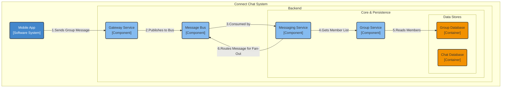
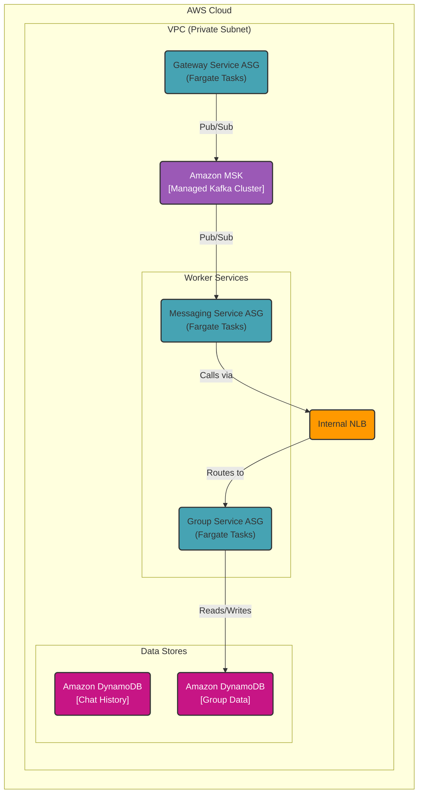

### **Group Management Service**

**Problem:**
The current architecture is designed for one-to-one communication and lacks the concept of a "group." To fulfill the group chat requirements (FR2.1-FR2.4), we need a system to manage the state and membership of potentially millions of groups. This includes creating groups, adding/removing users, and, most importantly, providing a way for the Messaging Service to look up the member list of a group to perform a message fan-out.

**Solution:**
We will introduce a new, dedicated **Group Service** and a corresponding **Group Database**.
1.  The **Group Service** will be the authoritative source for all group-related metadata. It will expose an internal API for CRUD (Create, Read, Update, Delete) operations on groups and their memberships.
2.  When a user sends a message to a group, the **Messaging Service** will call the **Group Service** with the `group_id` to retrieve the list of all current members.
3.  The **Group Database** will store this information, with a data model optimized for quickly fetching the members of a given group.

This decouples the complex logic of group management from the core message routing and persistence pathways, adhering to the single-responsibility principle.

**Trade-offs:**
*   **Technology Choice (Group Database - Amazon DynamoDB):**
    *   **Pros:**
        *   **Scalability:** DynamoDB can easily scale to handle the billions of potential membership entries across millions of groups.
        *   **Performance:** Provides low-latency reads, which is critical for the fan-out process where member lists must be fetched quickly.
        *   **Data Modeling:** We can use the Adjacency List design pattern within a single table to efficiently model the many-to-many relationships between users and groups.
    *   **Cons:**
        *   **Complexity:** The Adjacency List pattern is powerful but can be more complex to query than a traditional SQL model. This is a reasonable trade-off for achieving massive scale.
*   **Alternative Considered (Centralized Group Info in Chat DB):**
    *   Rejected as it would violate the single-responsibility principle. It would bloat the chat history database with relational metadata, forcing a single data store to be optimized for two very different access patterns (time-series writes vs. relational lookups), which is inefficient and hard to scale.

---

#### **Logical View (C4 Component Diagram)**

#### **Physical View (AWS Deployment Diagram)**

#### **Component-to-Resource Mapping Table**

| Logical Component | Physical Resource | Rationale |
| :--- | :--- | :--- |
| **(New) Group Service** | **AWS Fargate Tasks (Auto Scaling)** | **Decoupled & Scalable:** A dedicated microservice to handle group logic. Running on Fargate allows it to scale independently based on the rate of group-related operations (creates, joins, etc.), without impacting the core message pipeline. |
| **(New) Group Database**| **Amazon DynamoDB Global Tables**| **Performance & Scale:** DynamoDB provides the required scalability to store millions of groups and billions of membership records. A Global Table ensures this data is replicated across regions for low-latency reads and disaster recovery, consistent with our overall architecture. |
| **Messaging Service**| **AWS Fargate Tasks (Auto Scaling)** | (Updated) Now includes logic to call the Group Service to fetch member lists when a message is identified as a group message. |
