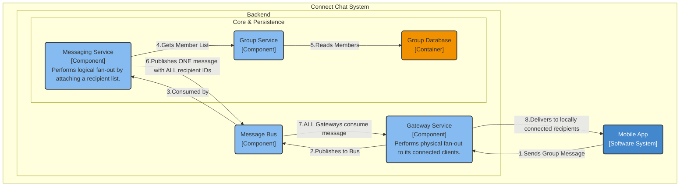
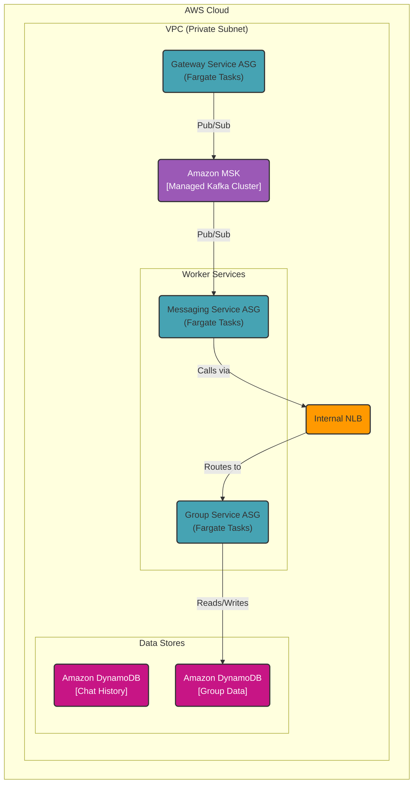

### **Group Message Fan-Out**

**Problem:**
The architecture can now manage group memberships, but it lacks the mechanism to perform a message "fan-out"—delivering a single message to all members of a group. A naive implementation, where the Messaging Service publishes a unique copy of the message for each group member, would fail to meet our peak read load requirement (NFR1.4). A single message to a 500-person group would generate 500 messages on our message bus, creating a massive traffic amplification that would bottleneck the system.

**Solution:**
We will implement a highly efficient **"Fan-out on Read"** (or "Edge Fan-out") pattern.
1.  **Single Publish:** When the **Messaging Service** processes a group message, it will fetch the full member list from the **Group Service**. It will then publish a **single message** to a dedicated `group_outgoing_messages` topic on the Message Bus. This message will contain the payload *and* the complete list of recipient `user_id`s in its metadata.
2.  **Distributed Fan-out:** Every instance in the **Gateway Service** fleet will subscribe to this `group_outgoing_messages` topic. When an instance consumes a message, it will iterate through the recipient list in the metadata. For each recipient, it checks if that user is currently connected to *itself*. If so, it delivers the message. If not, it simply ignores that user ID.

This design ensures the message is processed and transported through the core system only once. The actual fan-out work is distributed across the entire fleet of Gateway servers at the edge, making the process horizontally scalable.

**Trade-offs:**
*   **Fan-out on Read Strategy:**
    *   **Pros:**
        *   **Extreme Network Efficiency:** Prevents message amplification on the message bus, dramatically reducing internal bandwidth and processing costs. One sent message equals one message on the bus.
        *   **Scalable by Design:** The fan-out workload is spread across the Gateway fleet, which scales directly with the number of concurrent users.
    *   **Cons:**
        *   **Increased Gateway CPU Load:** Every Gateway instance must process every group message to check the recipient list. This increases the baseline CPU usage on the Gateway fleet, which must be accounted for in our auto-scaling configuration.
        *   **Larger Message Payloads:** Messages on the bus will be larger due to the included recipient list. This is a favorable trade-off compared to the massive amplification of sending individual messages.
*   **Alternative Considered (Fan-out on Write):**
    *   Rejected because publishing a message for every single recipient would create a "thundering herd" problem, overwhelming the message bus and failing to meet the peak message delivery NFR.

---

#### **Logical View (C4 Component Diagram)**

The logical components remain the same as in Issue #7. The change is in the data flow and the responsibilities of the existing components, which is best captured by refining the interaction labels.

#### **Physical View (AWS Deployment Diagram)**

The physical resources remain the same. This issue describes a change in the *logic* within the Fargate tasks and the *data* flowing through the Kafka topics, not a change in the infrastructure itself. The Physical View from Issue #7 is still correct.

#### **Component-to-Resource Mapping Table**

| Logical Component | Physical Resource | Rationale |
| :--- | :--- | :--- |
| **Gateway Service** | **AWS Fargate Tasks (Auto Scaling)** | (Updated) Subscribes to group message topics. Now responsible for **physical fan-out**: inspecting the recipient list of each message and delivering it only to clients connected to its specific instance. |
| **Messaging Service**| **AWS Fargate Tasks (Auto Scaling)** | (Updated) Responsible for **logical fan-out**: fetching the group member list from the Group Service and publishing a single message to the message bus containing the full list of recipient IDs. |
| **Group Service**| **AWS Fargate Tasks (Auto Scaling)**| (Unchanged) Provides the critical, low-latency lookup of group member lists. |
| **All other components**| (As previously defined) | (Unchanged) No changes to other components. |
