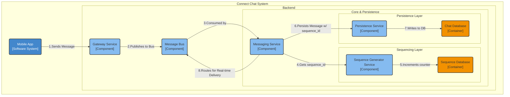
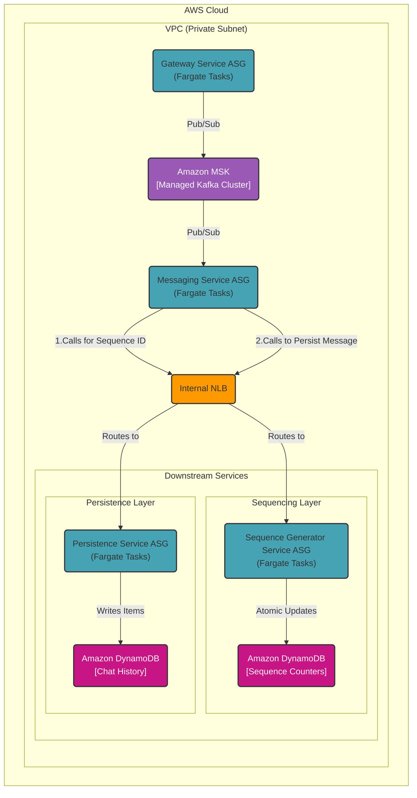

### **Global Message Ordering**

**Problem:**
In a globally distributed, asynchronous system, we cannot rely on processing time to order messages. Network latency or consumer lag could cause a message sent at `T1` to be processed *after* a message sent at `T2`, violating our strict ordering requirement (NFR4.2). This would result in conversations appearing out of order for users, which is a critical failure. We need an authoritative mechanism to guarantee that messages within any given chat are always stored and retrieved in the correct sequence.

**Solution:**
We will implement a centralized sequence generation pattern to assign a unique, monotonically increasing ID to every message within a specific chat.
1.  A new, highly available **Sequence Generator Service** will be introduced.
2.  When the **Messaging Service** consumes a message from the bus, its *first action* will be to request a new `sequence_id` from the Sequence Generator, passing the `chat_id`.
3.  The Sequence Generator will atomically increment a counter for that `chat_id` and return the new number.
4.  This `sequence_id` is then attached to the message.
5.  The **Chat Database (DynamoDB)** will use this ID as its **sort key**. The table's primary key will be a composite key of `Partition Key: chat_id` and `Sort Key: sequence_id`. This structure guarantees that when we query for a chat's history, the messages are always returned in the correct, immutable order.

**Trade-offs:**
*   **Technology Choice (Centralized Sequence Generator):**
    *   **Pros:**
        *   **Guaranteed Total Order:** Provides an absolute, unambiguous order for messages within a chat, which is the simplest and most robust solution for this requirement.
        *   **Idempotency:** The unique `sequence_id` can be used by the persistence layer to safely handle message retries without creating duplicates.
    *   **Cons:**
        *   **Potential Bottleneck:** The Sequence Generator is a critical, high-throughput service. It must be engineered for extremely low latency and high availability. An outage of this service would halt the processing of new messages.
        *   **Added Latency:** This design introduces a synchronous network call into the message processing path. The performance of this service is therefore critical.
*   **Alternative Considered (Using Timestamps):**
    *   Rejected because server clocks can drift, and network latency can cause out-of-order processing, making timestamps unreliable for strict ordering.
*   **Alternative Considered (Client-Side IDs):**
    *   Rejected because clients are untrusted and their clocks can be wildly inaccurate.

---

#### **Logical View (C4 Component Diagram)**

#### **Physical View (AWS Deployment Diagram)**

#### **Component-to-Resource Mapping Table**

| Logical Component | Physical Resource | Rationale |
| :--- | :--- | :--- |
| **(New) Sequence Generator Service** | **AWS Fargate Tasks (Auto Scaling)** | **Low-Latency & Scalable:** A simple, highly optimized microservice whose only job is to provide sequence numbers. Running on Fargate allows it to scale out to handle the very high request rate from the Messaging Service fleet. |
| **(New) Sequence Database**| **Amazon DynamoDB Table**| **Strong Consistency & Atomic Operations:** DynamoDB's atomic counters are a perfect fit for this use case. They provide a highly available and durable mechanism for atomically incrementing the sequence number for a given `chat_id`, which is the core requirement for this service. |
| **Chat Database** | **Amazon DynamoDB Global Tables**| (Updated) The schema is now defined with a primary key of `(Partition Key: chat_id, Sort Key: sequence_id)` to enforce and leverage the guaranteed ordering provided by the Sequence Generator. |
| **Messaging Service**| **AWS Fargate Tasks (Auto Scaling)** | (Updated) Now contains the critical logic to call the Sequence Generator *before* calling the Persistence Service, ensuring every message is correctly sequenced before being stored. |
